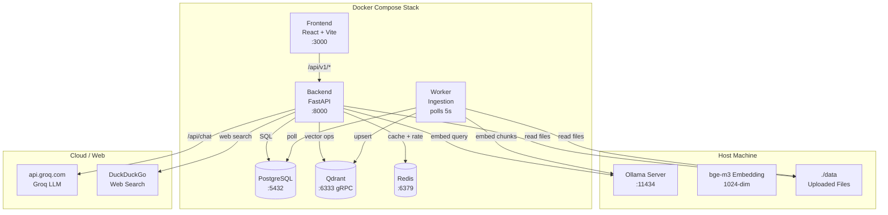

# Chatbot RAG — Hybrid Internal KB + Web Search

Chatbot internal berbasis **Retrieval-Augmented Generation (RAG)** dengan hybrid search, JWT auth + RBAC, observability (Prometheus), dan evaluasi otomatis. Jawaban selalu dari knowledge base internal (PDF, DOCX, CSV, XLSX) — web search hanya sebagai suplemen yang dilabel jelas, bukan sumber primer.

**LLM utama:** Groq (cloud, cepat). **Alternatif lokal:** Ollama (`LLM_PROVIDER=ollama`). **Embedding:** Ollama + `bge-m3` (host, GPU).

---

## Tech Stack

| Layer | Teknologi |
|-------|-----------|
| Backend | FastAPI (Python 3.10) |
| Frontend | React 18 + Vite |
| Vector DB | Qdrant v1.12.1, 1024-dim Cosine |
| Relational DB | PostgreSQL 16 |
| Cache | Redis 7 |
| Embedding | `bge-m3` via Ollama (host, GPU) |
| LLM | Groq (default) atau Ollama (`LLM_PROVIDER=ollama`) |
| Web Search | DuckDuckGo (gratis, no API key) |
| Container | Docker Compose (6 services) |
| Observability | Prometheus + JSON logs |
| CI | GitHub Actions (lint + test + eval) |

---

## Quick Start

```bash
# 1. Ollama on host
ollama pull bge-m3

# 2. Env
cp .env.example .env
# Edit .env → set GROQ_API_KEY, ADMIN_PASSWORD

# 3. Start
docker compose up --build -d

# 4. Login
# Browser: http://localhost:3000
# Default admin: admin / <ADMIN_PASSWORD>
```

---

## Architecture

### System



### RAG Pipeline (per query)

```mermaid
graph TB
    IN[POST /api/v1/chat/query]
    AUTH{JWT<br/>require_role}
    SAN[Sanitize +<br/>PII redact +<br/>injection scan]
    CAS{Casual<br/>greeting?}
    OOS{Out of<br/>scope?}
    RAG[Intent = rag_question]
    PRI[Intent = price_query]
    PRICE[PriceQueryOrchestrator]
    RAGORCH[RagOrchestrator]
    ABSTAIN[ABSTAIN_MESSAGE<br/>sources=[]]
    OUT[QueryResponse]

    IN --> AUTH --> SAN --> CAS
    CAS -->|yes| OUT
    CAS -->|no| OOS
    OOS -->|yes| OUT
    OOS -->|no| RAG
    RAG --> RAGORCH -->|empty KB| ABSTAIN
    RAGORCH -->|has chunks| OUT
    RAG -->|intent=price| PRI
    PRI --> PRICE -->|no results| RAG
    PRICE -->|has results| OUT
```

**RagOrchestrator flow:**
1. Rewrite query (if short) using LLM + history
2. Expand synonyms
3. Embed via Ollama (bge-m3)
4. **Parallel:** Qdrant (KB) + DuckDuckGo (web cache)
5. Progressive fallback: lower threshold if 0 results
6. Inject structured facts (CSV date queries)
7. **Answerability gate** — if no internal chunks → ABSTAIN (web NEVER replaces)
8. Build context (only when internal chunks exist)
9. LLM generates answer
10. Validate citations, sanitize output

---

## Services

| Service | Port | Role |
|---------|------|------|
| `frontend` | 3000 | React + Vite web UI |
| `backend` | 8000 | FastAPI REST API + RAG orchestration |
| `worker` | — | Background ingestion (polls every 5s) |
| `db` | 5432 | PostgreSQL 16 (users, docs, sessions, audit) |
| `qdrant` | 6333/6334 | Vector storage (Cosine 1024-dim) |
| `redis` | 6379 | Web cache (1h), rate limiting |
| `ollama` | 11434 | **Host only** — embedding always, LLM if `LLM_PROVIDER=ollama` |

---

## Auth & RBAC

JWT-based. 4 roles:

| Role | KB Access | Endpoints |
|------|-----------|-----------|
| `viewer` | `internal` only | `POST /chat/query`, `POST /chat/feedback` |
| `document_admin` | `internal` + `restricted` | + upload/list/delete documents |
| `system_admin` | all (`internal` + `restricted` + `confidential`) | + register new users |
| `auditor` | all (read-only) | list documents |

**Default admin:** seeded on startup from `ADMIN_USERNAME` / `ADMIN_PASSWORD` env.

**Switch LLM provider:** `LLM_PROVIDER=groq` (default) or `ollama`. `OLLAMA_BASE_URL` + `OLLAMA_CHAT_MODEL` for local.

---

## Project Structure

```
backend/
  app/
    main.py                          # FastAPI app + global exception handler
    config.py                        # Re-export from core.config
    core/config.py                   # Pydantic settings
    database.py                      # SQLAlchemy session
    middleware/
      auth.py                        # get_current_user + require_role
      metrics.py                     # Prometheus counters + /metrics endpoint
    models/                          # SQLAlchemy models (no __init__.py)
      document.py, user.py, price.py, chat.py, ingestion.py, market_price.py, audit.py
    routers/
      auth.py                        # POST /auth/login, /auth/register
      chat.py                        # POST /chat/query, /chat/feedback (thin)
      documents.py                   # upload, list, delete
    schemas/                         # Pydantic request/response
    services/
      auth.py                        # hash + JWT (stdlib hashlib + PyJWT)
      seed_admin.py                  # env-driven admin seed
      general_intent.py              # 4-intent routing
      rag_orchestrator.py            # RAG pipeline (rewrite→embed→search→gate→LLM)
      price_orchestrator.py          # 4-way price pipeline
      prompt_guard.py                # 5-layer prompt injection defense
      sanitizer.py                   # PII redaction + injection scan
      answerability.py               # Gate (high/medium/low/abstain)
      qdrant_client.py               # Qdrant ops + access_level filter
      embedding.py                   # Ollama bge-m3 embeddings
      groq_client.py                 # LLM dispatcher (Groq|Ollama)
      ollama_client.py               # Ollama chat LLM (urllib)
      search_client.py               # DuckDuckGo + DNS patch
      strict_mode.py                 # Casual greeting responses
      structured_extractor.py        # CSV/Excel date-fact extraction
      chunking.py                    # Recursive splitter (inline ~100 LOC)
      price_service.py               # PostgreSQL price queries (catalog/OHLC/range)
      price_orchestrator.py          # Price pipeline orchestrator
      marketplace_scraper.py         # Tokopedia/Shopee via DDG site:
      csv_product_mapper.py          # Auto-ingest CSV catalog
      scheduler.py                   # Session cleanup (background)
      audit_log.py                   # Web search audit
    scripts/                         # Ops scripts (sys.path stub)
    worker.py                        # Ingestion worker (standalone)
  alembic/versions/0001..0006         # Migrations
  tests/                            # 347 unit tests
  evals/                             # Eval harness (cases.yaml + runner.py)
  loadtest/run_loadtest.sh           # wrk-based load test
frontend/
  src/
    App.jsx                          # Routes: Login | Chat | AdminPanel
    api.js                           # axios + token interceptor
    components/
      Login.jsx, Chat.jsx, AdminPanel.jsx, PriceCitations.jsx
docs/
  deployment.md, backup-restore.md, load-test-report.md
.github/workflows/
  ci.yml                             # lint + test + eval
  deploy.yml                         # Build images on main
```

---

## API Endpoints

```
POST /api/v1/auth/login              # Public
POST /api/v1/auth/register           # system_admin only
POST /api/v1/chat/query              # viewer+ (hybrid: KB + web supplement)
POST /api/v1/chat/feedback           # viewer+
POST /api/v1/documents/upload        # document_admin+
GET  /api/v1/documents               # document_admin+, auditor
DELETE /api/v1/documents/{id}        # document_admin+
GET  /healthz/live                   # Liveness probe
GET  /healthz/ready                  # Readiness probe (DB + Qdrant)
GET  /health                         # Full health JSON
GET  /metrics                        # Prometheus (text/plain)
```

---

## Observability

`GET /metrics` exposes:

```
http_requests_total{method,path,status}              # Counter
http_request_duration_seconds{method,path,status}   # Histogram (9 buckets)
chat_queries_total{intent,outcome}                   # casual|oos|price|rag
ingestion_jobs_total{status}                         # completed|failed|retried
answerability_abstains_total{reason}                 # out_of_scope|low|...
citation_validations_total{result}                   # valid|invalid|regenerated
```

Scrape with Prometheus. JSON logs to stdout.

---

## Evaluation

```bash
cd backend
python evals/runner.py        # 28 cases, 100% intent accuracy
```

Cases cover: factual, out_of_scope, casual, price_query, adversarial. Tests intent classifier only (not full LLM pipeline — needs live infra).

---

## Testing

```bash
cd backend
pytest tests/ --ignore=tests/test_e2e_ohlc.py \
              --ignore=tests/test_e2e_price.py \
              --ignore=tests/test_http_price.py
# 347 passed
```

---

## CI / CD

`.github/workflows/ci.yml` runs on every push/PR to main:
- `backend-lint` — ruff + black + mypy
- `backend-test` — 347 unit tests
- `eval` — intent classifier accuracy

`.github/workflows/deploy.yml` builds images on main push.

---

## Access Level Filter

Qdrant payload includes `access_level: internal|restricted|confidential`. Filter on retrieval:

```
viewer          → internal only
document_admin  → internal + restricted
system_admin    → all
auditor         → all (read-only)
```

Existing points (pre-P0) lack this field — run `python backfill_access_level.py` once.

---

## Run Mode

### Dev (no Docker)

```bash
# Backend
cd backend
pip install -r requirements.txt
alembic upgrade head
uvicorn app.main:app --reload --port 8000

# Worker (separate terminal)
cd backend
python -m app.worker
```

### Production

```bash
docker compose up -d
```

See `docs/deployment.md` for nginx, TLS, hardening.

---

## Backup & Restore

See `docs/backup-restore.md`. Quick reference:

```bash
# DB
docker compose exec -T db pg_dump -U postgres chatbot | gzip > db-$(date +%F).sql.gz

# Restore
docker compose exec -T db psql -U postgres chatbot < db-2026-06-26.sql.gz
```

---

## Known Limitations

- **Out-of-scope queries** answered with refusal (no hallucination)
- **No streaming** — POST /chat/query is non-streaming
- **Web search** used as supplement only (labeled [W1], [W2])
- **LLM latency** depends on Groq response time (~1-2s typical)
- **No production auth hardening** — JWT secret defaults to "supersecret" (CHANGE in .env)
- **Not Agentic RAG** — pipeline is rule-based, not LLM-driven tool selection

---

## Roadmap

| Phase | Status | What |
|-------|--------|------|
| P0 | ✅ | JWT + 4 roles + access_level filter |
| P1 | ✅ | Intent classifier + RAG/Price orchestrators |
| P2 | ✅ | Prometheus metrics + eval harness |
| P3 | ✅ | CI + healthchecks + ops docs |
| Housekeeping | ✅ | Drop langchain+requests deps, dead code |
| Future | — | Agentic RAG (LLM tool selection), streaming, frontend feedback UI |
