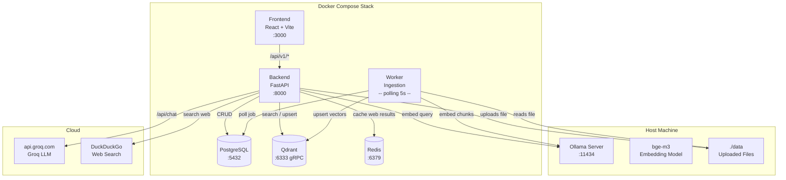
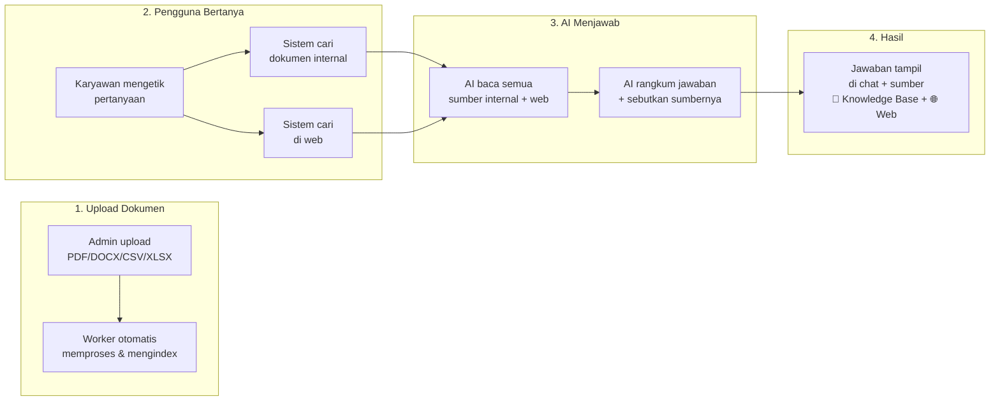
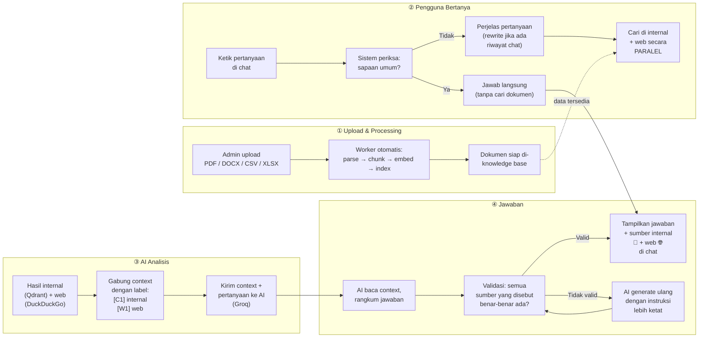
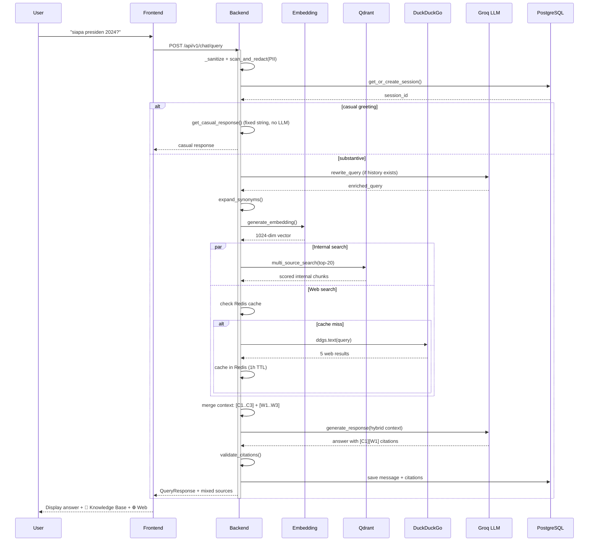
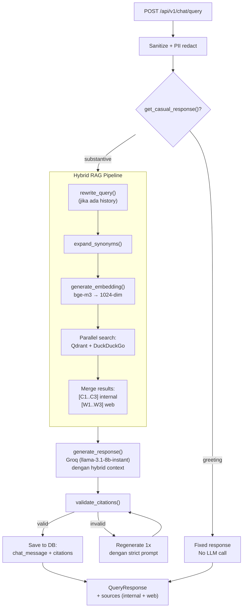
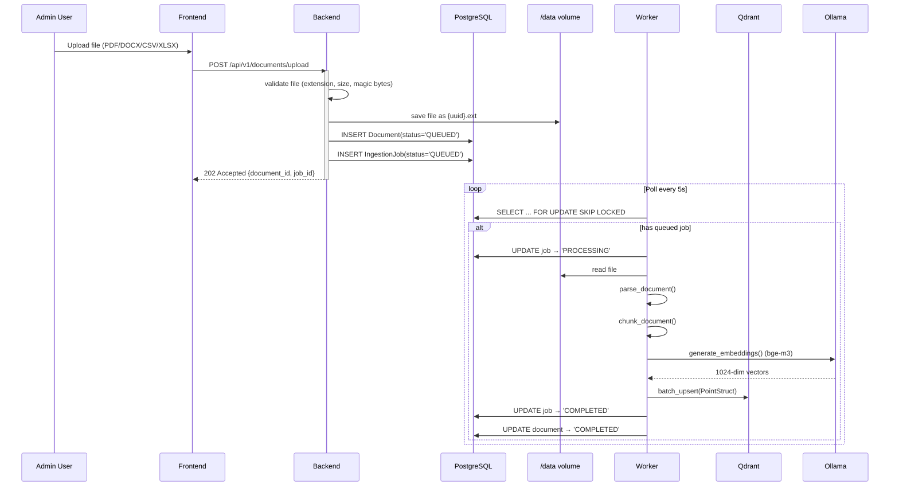
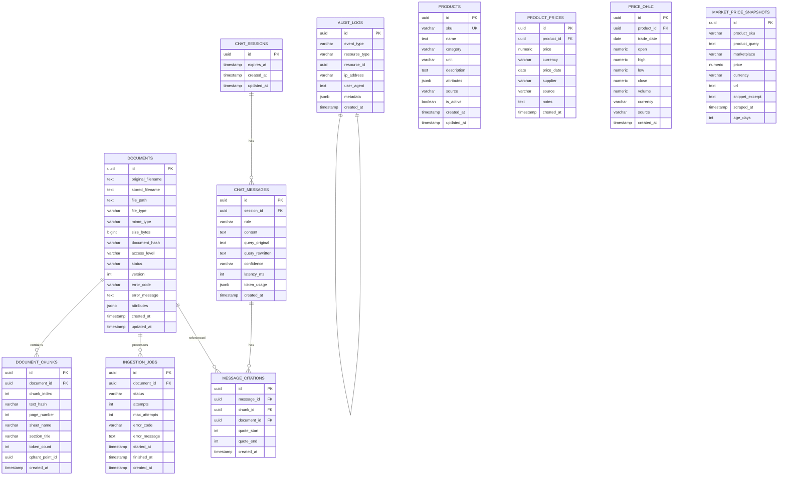

# Chatbot RAG — Hybrid Internal + Web Search

Chatbot berbasis **Retrieval-Augmented Generation (RAG)** dengan hybrid search — mencari dari dokumen internal (PDF, DOCX, CSV, XLSX) DAN dari web secara paralel. LLM utama: **Groq** (cloud, cepat). Alternatif lokal: **Ollama** (`LLM_PROVIDER=ollama`). Embedding selalu via Ollama + `bge-m3`.

---

## Tech Stack

| Layer | Teknologi |
|-------|-----------|
| Backend | FastAPI (Python 3.10) |
| Frontend | React 18 + Vite |
| Vector DB | Qdrant v1.12.1 (1024-dim Cosine) |
| Relational DB | PostgreSQL 16 |
| Cache | Redis 7 |
| Embedding | `bge-m3` via Ollama (lokal, GPU) |
| LLM | **Groq** (cloud, primary) or **Ollama** (local, set `LLM_PROVIDER=ollama`) |
| Web Search | DuckDuckGo (gratis, no API key) |
| Chunking | LangChain `RecursiveCharacterTextSplitter` |
| Container | Docker Compose (6 services) |

---

## Quick Start

```bash
# 1. Prerequisites: Ollama running on host with GPU
ollama pull bge-m3

# 2. Setup environment
cp .env.example .env
# Isi GROQ_API_KEY jika LLM_PROVIDER=groq (default).
# Untuk local LLM, set LLM_PROVIDER=ollama (lihat "Switching LLM provider").

# 3. Start all services
docker compose up --build -d

# 4. Buka browser
open http://localhost:3000
```

---

## Architecture

### System Architecture



### Services

| Service | Port | Platform | Role |
|---------|------|----------|------|
| `frontend` | 3000 | Node + Vite (React 18) | Web UI |
| `backend` | 8000 | Python 3.10 + FastAPI | REST API, RAG + hybrid search orchestration |
| `worker` | — | Python 3.10 (standalone) | Background ingestion (polling 5s) |
| `db` | 5432 | PostgreSQL 16 | Metadata, sessions, feedback, audit |
| `qdrant` | 6333/6334 | Qdrant v1.12.1 | Vector storage (1024-dim Cosine) |
| `redis` | 6379 | Redis 7 | Web search cache, rate limiting |
| `ollama` | 11434 | Host machine (NOT containerized) | Embedding always (`bge-m3`); chat LLM when `LLM_PROVIDER=ollama` |

### Component Architecture (Backend)

```mermaid
graph TB
    subgraph "FastAPI Application"
        RT[Routers<br/>chat.py / documents.py]
        SR[Services Layer]
        MD[Models<br/>SQLAlchemy]
        SC[Schemas<br/>Pydantic]
        CFG[Config<br/>Pydantic Settings]
    end

    subgraph "Services"
        LLM[LLM Client<br/>groq_client.py<br/>(dispatcher)]
        OLL[Ollama Client<br/>ollama_client.py]
        EMD[Embedding<br/>embedding.py]
        QDR[Qdrant Client<br/>qdrant_client.py]
        CHK[Chunking<br/>chunking.py]
        DOCP[Document Processor<br/>document_processor.py]
        ANS[Answerability Gate<br/>answerability.py]
        STR[Structured Extractor<br/>structured_extractor.py]
        SAN[Sanitizer<br/>sanitizer.py]
        SCH[Session Scheduler<br/>scheduler.py]
        SRC[Search Client<br/>search_client.py]
        SCA[Search Cache<br/>search_cache.py]
        AUD[Audit Log<br/>audit_log.py]
    end

    subgraph "External"
        QD[(Qdrant)]
        DB[(PostgreSQL)]
        RD[(Redis)]
        GR["api.groq.com<br/>Groq LLM"]
        DDG[DuckDuckGo<br/>Web Search]
    end

    RT --> SR
    SR --> LLM
    SR --> EMD
    SR --> QDR
    SR --> CHK
    SR --> DOCP
    SR --> ANS
    SR --> STR
    SR --> SAN
    SR --> SRC
    SRC --> SCA
    SRC --> DDG
    SCA --> RD
    SR --> AUD
    LLM --> GR
    OLL --> OLLAMA
    QDR --> QD
    SR --> DB
    CFG -->|env vars| SR
    CFG -->|env vars| RT
```

### Arsitektur Non-Teknis (End-to-End)



### Alur End-to-End Sistem



**Penjelasan langkah-langkahnya:**

1. **Upload** — Admin upload file (PDF/DOCX/CSV/XLSX) lewat panel admin. Worker langsung memproses di latar belakang: membaca teks, memotong jadi segmen kecil (chunk), mengubahnya menjadi vector, menyimpannya di Qdrant.
2. **Pertanyaan** — Pengguna mengetik pertanyaan. Sistem cek apakah ini sapaan (halo, hai) atau pertanyaan serius. Kalau serius, pertanyaan diperjelas jika ada riwayat chat sebelumnya.
3. **Pencarian Paralel** — Sistem mencari di **dua tempat sekaligus**: (a) di dokumen internal via Qdrant, dan (b) di web via DuckDuckGo. Hasil dari keduanya digabung dengan label berbeda.
4. **Analisis AI** — AI (Groq) membaca context dari internal + web, lalu merangkum jawaban. Setiap klaim harus menyebut sumbernya (`[C1]` untuk internal, `[W1]` untuk web).
5. **Validasi** — Sistem periksa apakah sumber yang disebut AI benar-benar ada. Jika tidak, AI diminta generate ulang.
6. **Hasil** — Jawaban muncul di chat dengan badge **📁 Knowledge Base** untuk sumber internal dan **🌐 Web** untuk sumber online. User bisa klik link web langsung.

### RAG Query Sequence (Hybrid)



### Request Processing Flow



### Document Ingestion Sequence



### Database Schema (PostgreSQL)



---

## API Endpoints

### Chat

| Method | Path | Description |
|--------|------|-------------|
| `POST` | `/api/v1/chat/query` | **Hybrid RAG query** (internal + web search, non-streaming) |
| `POST` | `/api/v1/chat/feedback` | Thumbs up/down (`positive`/`negative`) |

### Documents

| Method | Path | Description |
|--------|------|-------------|
| `POST` | `/api/v1/documents/upload` | Upload (multipart, returns 202) |
| `GET` | `/api/v1/documents` | List (paginated: `?page=1&per_page=50`) |
| `DELETE` | `/api/v1/documents/{id}` | Soft delete + Qdrant cleanup |

### Health

| Method | Path | Description |
|--------|------|-------------|
| `GET` | `/health` | DB + Qdrant connectivity |
| `GET` | `/healthz/live` | Liveness probe |
| `GET` | `/healthz/ready` | Readiness probe (DB + Qdrant) |

### Contoh Query

```bash
curl -X POST http://localhost:8000/api/v1/chat/query \
  -H "Content-Type: application/json" \
  -d '{"query":"apa itu bitcoin"}'
```

Response:
```json
{
  "session_id": "uuid",
  "reply": "Termurah: Tokopedia Rp 2.150.000 untuk Polytron PAS 8C28 [3]. Database internal: Rp 2.500.000 [2]. Selisih: Rp 350.000 lebih murah di Tokopedia.",
  "message_id": "uuid",
  "sources": [
    {"file_name": "bitcoin.pdf", "source_type": "internal"},
    {"title": "Bitcoin - Wikipedia", "url": "https://en.wikipedia.org/wiki/Bitcoin", "source_type": "external"}
  ],
  "confidence": "high",
  "fallback_triggered": false,
  "out_of_context": false,
  "metadata": {
    "nl_sources": [
      {"id": 1, "label": "Database ...", "price": "IDR 2,500,000", "type": "internal", "is_stale": false, "age_days": 0},
      {"id": 2, "label": "Tokopedia ...", "price": "IDR 2,150,000", "type": "marketplace", "marketplace": "tokopedia"}
    ],
    "market_prices": [
      {"marketplace": "tokopedia", "price": 2150000.0, "currency": "IDR", "url": "https://tokopedia.com/...", "is_cached": true}
    ]
  }
}
```

---

## Environment Variables

| Variable | Default | Description |
|----------|---------|-------------|
| **LLM** | | |
| `LLM_PROVIDER` | `groq` | `groq` (cloud) or `ollama` (local) |
| `GROQ_API_KEY` | — | **Required** when `LLM_PROVIDER=groq` |
| `GROQ_MODEL` | `llama-3.1-8b-instant` | Groq chat model |
| `OLLAMA_CHAT_MODEL` | `qwen2.5:7b` | Chat model when `LLM_PROVIDER=ollama` |
| **Embedding** | | |
| `EMBEDDING_MODEL` | `bge-m3` | Embedding model via Ollama (host) |
| `EMBEDDING_DIM` | `1024` | Must match Qdrant collection dim |
| `OLLAMA_BASE_URL` | `http://host.docker.internal:11434` | Ollama endpoint (host machine) |
| **RAG Pipeline** | | |
| `SIMILARITY_THRESHOLD` | `0.55` | Config default; **tune to 0.40** for bge-m3 |
| `CHUNK_SIZE` | `200` | Local default; `512` in docker-compose |
| `CHUNK_OVERLAP` | `25` | Local default; `50` in docker-compose |
| `HYBRID_TOP_K` | `20` | Max candidates from Qdrant |
| `TOP_K` | `5` | Max chunks sent to LLM context |
| `MAX_QUERY_LENGTH` | `2000` | Sanitize-truncate cap |
| **Web Search** | | |
| `ENABLE_WEB_SEARCH` | `true` | Global toggle for hybrid search |
| `SEARCH_MAX_RESULTS` | `5` | Max web results per query |
| `SEARCH_TIMEOUT` | `10` | DuckDuckGo timeout (seconds) |
| `SEARCH_CACHE_TTL` | `3600` | Redis web-search cache TTL (seconds) |
| **Sessions** | | |
| `SESSION_TIMEOUT_MINUTES` | `30` | Server-side TTL for chat session |
| `MAX_HISTORY_TURNS` | `10` | History depth for query rewriting |
| `SESSION_CLEANUP_INTERVAL` | `300` | Background cleanup cadence (seconds) |
| **Upload** | | |
| `MAX_FILE_SIZE_MB` | `50` | Per-upload cap |
| `DATA_DIR` | `/data` | Shared volume for uploaded files |
| **Server** | | |
| `CORS_ORIGINS` | `http://localhost:3000,http://localhost:5173` | Comma-separated allowed origins |
| `RATE_LIMIT_CHAT_MAX` | `30` | Per-IP chat rate limit / window |
| `RATE_LIMIT_ADMIN_MAX` | `15` | Per-IP admin rate limit / window |
| `RATE_LIMIT_WINDOW` | `60` | Rate-limit window (seconds) |
| `ADMIN_API_KEY` | `supersecret` | `X-API-Key` for admin endpoints |
| `REDIS_URL` | `redis://redis:6379/0` | Redis connection string |

---

## Key Design Decisions

| Decision | Alasan |
|----------|--------|
| **Hybrid RAG (internal + web)** | Setiap query cari di Qdrant + DuckDuckGo paralel. Hasil digabung dengan label `[C1]` (internal) dan `[W1]` (web). LLM synthesizes natural answer. |
| **Groq sebagai primary LLM** | Groq cloud GPU ~200 tok/s vs Ollama lokal ~10 tok/s. Latency turun dari 40-50s ke ~3s per query. Embedding tetap via Ollama (ringan, 0.1s). Bisa switch ke Ollama untuk chat juga (`LLM_PROVIDER=ollama`), latency ~5-15s tapi zero external dependency. |
| **DuckDuckGo gratis (no API key)** | Provider web search gratis, unlimited. Ada DNS spoofing di ISP Indonesia — fix via `extra_hosts` di docker-compose + Python DNS patch. |
| **Redis cache web search** | Query yang sama dalam 1 jam tidak perlu search ulang ke DuckDuckGo. Cache key = SHA256(query). |
| **Chunk-ID citation dual** | Bukan semantic similarity post-hoc. LLM diminta pakai `[C1]` untuk internal, `[W1]` untuk web — divalidasi regex. |
| **Non-streaming endpoint** | SSE streaming uvicorn corrupted pada async generator pendek. |
| **`native_enum=False` + `values_callable`** | SAEnum PostgreSQL menyimpan string. `values_callable=lambda obj: [e.value for e in obj]` memaksa validasi pakai enum value (lowercase) agar cocok dengan data di DB. |
| **CSV catalog skip embedding** | CSV Barang/Brand/Tipe/Harga di-parse langsung ke tabel `products` (SQL ILIKE cukup untuk retrieval). Hemat 175×N chunks dan tidak butuh Ollama untuk catalog ingestion. |
| **PII redaction sebelum web search** | Query di-redact (NIK, email, phone) sebelum dikirim ke DuckDuckGo. |
| **Audit log untuk web search** | Setiap web search call tercatat di tabel `audit_logs` (query, provider, latency, results_count). |
| **Marketplace scraper (DDG site:)** | Cari harga pasaran via `site:tokopedia.com "produk" harga` — cached 24j di `market_price_snapshots`. Tidak scrape halaman langsung (ToS aman). 7 marketplace: Tokopedia, Shopee, Lazada, Bukalapak, Bhinneka, Blibli, Official Store. |
| **Strict product matching** | Web result hanya disimpan jika snippet mengandung nomor model (e.g. "PAS 8C28"). Drop hasil generik. |
| **Smart result selection** | Hanya tampilkan 2-4 sumber terbaik (termurah + terbaru). Stale data >30hari demo ke bawah dengan peringatan. |
| **Freshness badge** | Setiap source card menampilkan 🕐 hari ini / 🕐 X hari lalu. Stale data dapat border kuning. |
| **Single-sentence LLM answer** | LLM di-prompt untuk menjawab SATU KALIMAT menyoroti harga termurah + selisih. |
| **Collapsible source cards** | Frontend show max 3 sumber, sisanya di "Lihat N lainnya" expander. |

---

## Recent Audit (commit `75094ef`)

Ponytail-style code audit removed 1866 net lines (-2059/+193) across 57 files. Summary of what was cut:

**Dead code removed**
- `app/services/llm_client.py` (LLMProvider ABC + factory — Groq is the only impl)
- `app/services/circuit_breaker.py` (single use, inlined)
- `app/services/ingestion.py` (worker has its own pipeline)
- `app/models/{user,evaluation,feedback}.py` (no consumers)
- `app/core/logging.py` (log_interaction never called)
- `frontend/src/components/PriceTable.jsx` (replaced by PriceCitations)
- `POST /api/v1/chat/stream` endpoint + `sendQueryStream` (frontend never used)
- Functions: `generate_response_stream`, `format_context`, `insert_citations`,
  `is_citation_valid`, `build_price_table`, `to_markdown_row`,
  `_find_unit_column`, `StrictModeResult`+`classify_query`,
  `_validate_required_config`, `_warmup_embedding`,
  prometheus-instrumentator middleware, request_id middleware

**Config dropped** (15 fields)
GOOGLE_API_KEY, GOOGLE_CSE_ID, TAVILY_API_KEY, JWT_SECRET_KEY,
ENABLE_EXTERNAL_FALLBACK, SEARCH_PROVIDER, QDRANT_URL, QDRANT_GRPC_PORT,
RATE_LIMIT_CLEANUP_INTERVAL, SESSION_MAX_TURNS, vector_size/VECTOR_SIZE,
RATE_LIMIT_MAX, ADMIN_RATE_LIMIT_MAX legacy aliases, `noqa: F401`-flagged
`vector_size` Settings.

Note: `LLM_PROVIDER` and `OLLAMA_LLM_MODEL` were initially dropped in this
commit, then re-added in `87b6330` as the switch for the local Ollama
chat-LLM fallback. See "Switching LLM provider" section below.

**Deps removed** (-6)
`pypdf2` (only pdfplumber used), `httpx` (never imported),
`tiktoken` (never imported), `prometheus-fastapi-instrumentator`,
`langchain`, `langchain-community` (only `langchain-text-splitters` remains).

**Bugfix bundled in audit**
The original audit deleted `User`/`Role`/`UserRole` model files. This left
dangling `ForeignKey("users.id")` on `chat_sessions.user_id`,
`chat_messages.user_id`, `documents.uploaded_by`,
`audit_logs.actor_user_id`. SQLAlchemy raised `NoReferencedTableError`
on every insert → every `/chat/query` returned 500. The fix:
- Dropped the four FK columns from the models
- Dropped the matching columns + FKs in the live DB
- Updated `services/audit_log.py` to drop the `actor_user_id` param

**Other shrinks**
- `get_marketplace_label` deduplicated (deleted from response_formatter,
  imports from marketplace_scraper)
- `from calendar import monthrange` hoisted out of 4 function-local imports
  in `intent_classifier.py`
- Dead `FallbackRequest`/`FallbackResponse`/`ExternalSource` schemas
  deleted (`/chat/fallback` endpoint was removed long ago)
- Redundant stale pre-sort removed from `chat._handle_price_query`
  (select_top_results already handles it)
- `marketplace_scraper.__all__` trimmed to 3 actually-used exports
- `_find_column` candidates pattern unified

Verified after: `ruff check app/ alembic/env.py` returns 0 import errors.
All 3 chat-query types verified end-to-end (casual, RAG, price).

---

## Switching LLM provider

Chat completion is configurable via `LLM_PROVIDER`. Default is `groq` (cloud). Set to `ollama` to use a local model — no code change, no rebuild.

**Switch to local Ollama** (in `.env`):

```env
LLM_PROVIDER=ollama
OLLAMA_CHAT_MODEL=qwen2.5:7b
```

Then restart the backend:

```bash
docker compose up -d backend
```

The dispatcher in `groq_client.py:generate_response()` routes to `ollama_client.py:generate_response_ollama()`. All callers (`chat.py`) work unchanged.

**Prerequisites** (host machine):

```bash
ollama serve              # already running if embedding works
ollama pull qwen2.5:7b    # default model; ~4.7GB
```

Other working models: `qwen2.5-coder:7b`, `llama3.1:latest`, `Mistral:7b`, `qwen3.5:9b`. **Do NOT use `qwen3.5:4b`** — it's a thinking model (~29s per greeting).

**Trade-offs**:
- **Groq**: ~2-4s/query, requires `GROQ_API_KEY`, costs API credits
- **Ollama**: ~5-15s/query, free, needs local GPU/RAM, no external dependency

Frontend behavior is identical — same response shape, same sources, same citations. Only latency differs.

**Rollback**: change `LLM_PROVIDER=ollama` back to `groq`, restart backend.

Both paths share retry logic (3x exponential backoff) and PII redaction (`redact_pii(context)`).

---

## Developer Commands

```bash
# Dari folder backend/
make lint          # ruff check .
make format        # ruff check --fix . && black .
make typecheck     # mypy app/
make test          # python -m pytest tests/ -v
make test-cov      # with coverage report

# Docker
docker compose logs backend -f   # Backend logs
docker compose logs worker -f    # Worker logs

# Cleanup failed/duplicate documents (dari folder backend/)
python -m app.scripts.cleanup_failed_documents           # list only
python -m app.scripts.cleanup_failed_documents --all --dry-run   # preview
python -m app.scripts.cleanup_failed_documents --all --yes       # apply

# Reset seluruh knowledge base (dari folder backend/)
python -m app.scripts.reset_knowledge                    # list only
python -m app.scripts.reset_knowledge --dry-run           # preview
python -m app.scripts.reset_knowledge --yes               # execute

# Hapus cache marketplace (dari folder backend/)
python -m app.scripts.cleanup_market_snapshots            # list only
python -m app.scripts.cleanup_market_snapshots --yes      # execute

# Debug
docker compose exec backend python -c "from app.config import SIMILARITY_THRESHOLD; print(SIMILARITY_THRESHOLD)"
docker compose exec backend python -c "from app.services.search_client import search_web; r=search_web('test'); print(len(r), 'results')"

# Knowledge base reset (dari folder backend/)
docker compose exec backend python -m app.scripts.reset_knowledge --dry-run
docker compose exec backend python -m app.scripts.reset_knowledge --yes

# Marketplace cache cleanup (dari folder backend/)
docker compose exec backend python -m app.scripts.cleanup_market_snapshots --dry-run --older-than 7
docker compose exec backend python -m app.scripts.cleanup_market_snapshots --yes --older-than 7

# Marketplace debug
docker compose exec backend python -c "from app.services.marketplace_scraper import MarketplaceScraper; from app.database import SessionLocal; s=MarketplaceScraper(SessionLocal()); r=s.search_all('Polytron PAS 8C28'); [print(m.marketplace, m.price, 'cached' if m.is_cached else 'fresh') for m in r]"
```
