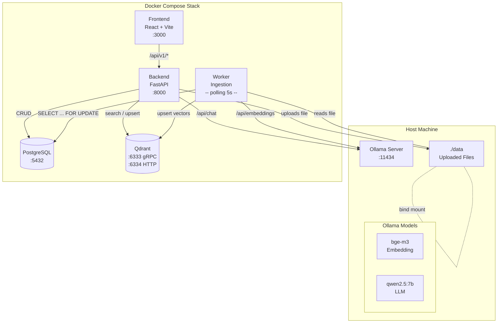
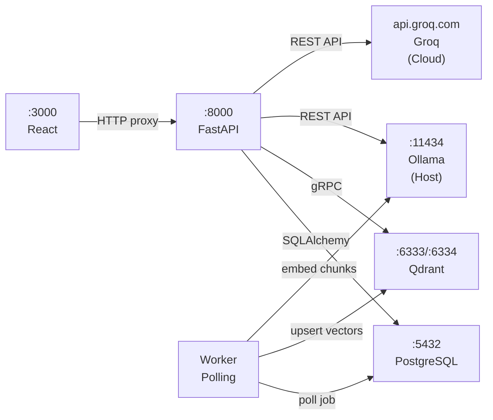
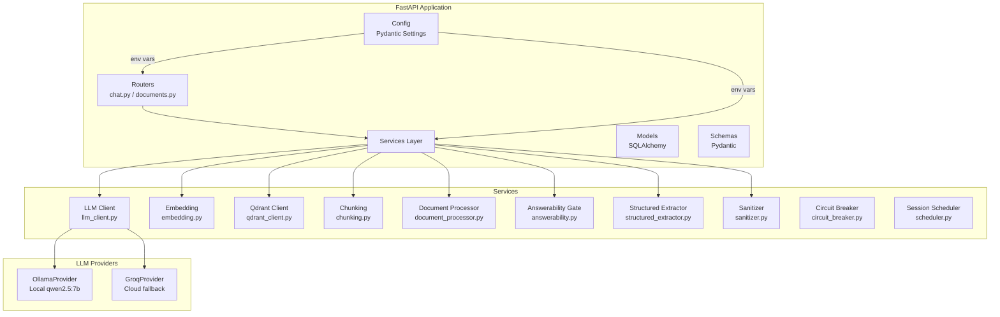
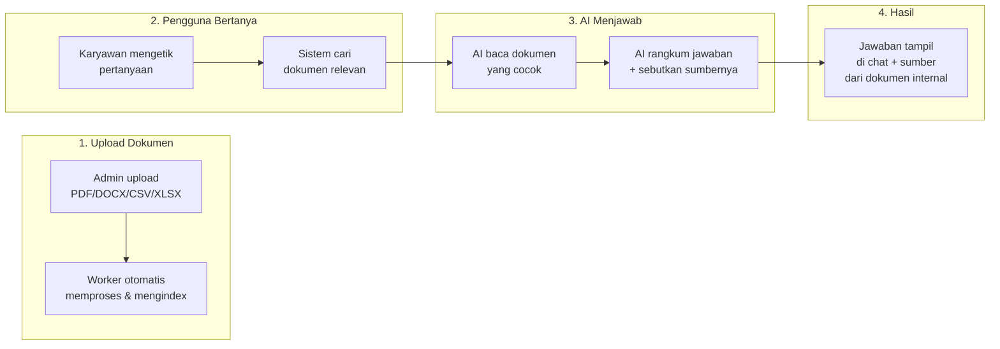
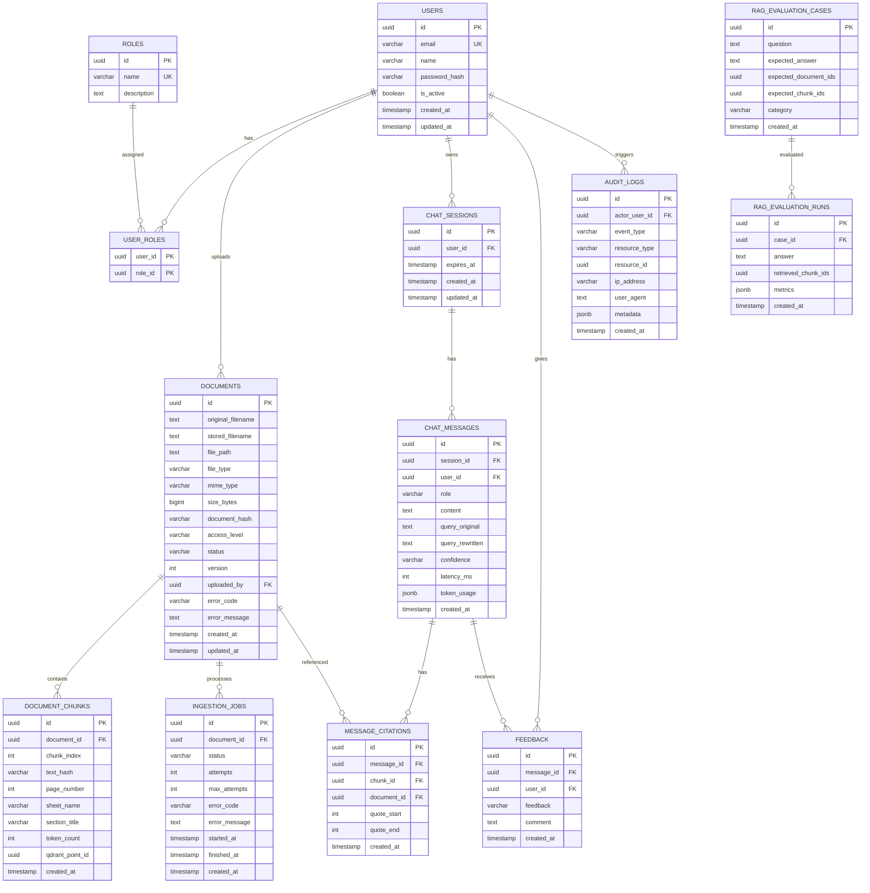
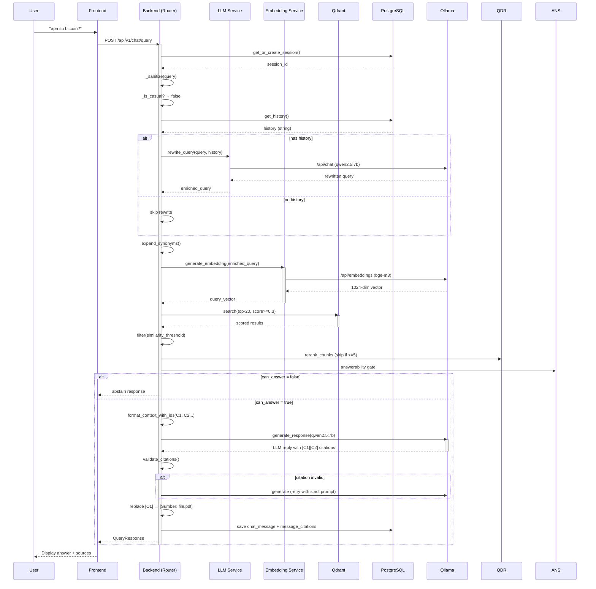
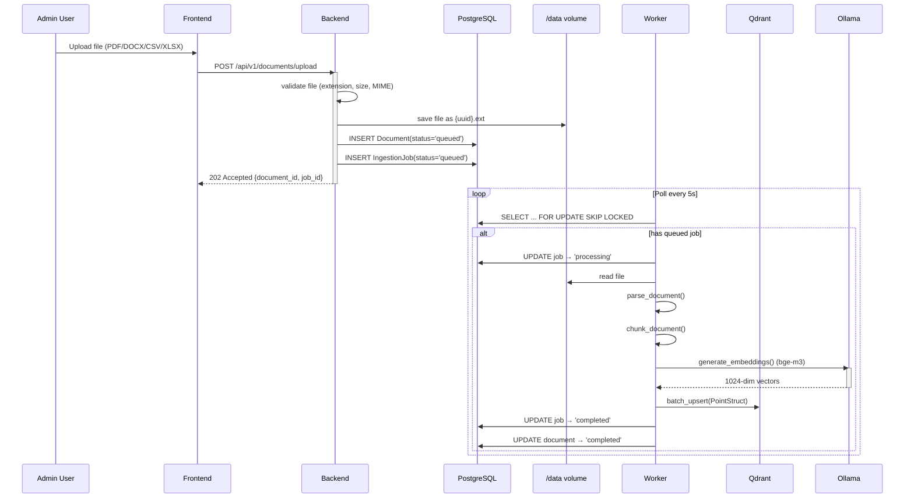
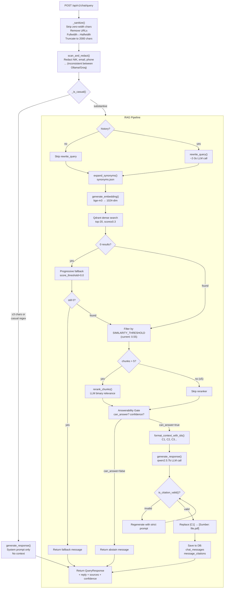

# Chatbot RAG — Internal Knowledge Base

Chatbot berbasis **Retrieval-Augmented Generation (RAG)** untuk knowledge base internal. Mendukung PDF, DOCX, CSV, dan XLSX — 100% lokal via **Ollama + bge-m3 + qwen2.5:7b** dengan **Groq auto-fallback**.

## Tech Stack

| Layer | Teknologi |
|-------|-----------|
| Backend | FastAPI (Python 3.10) |
| Frontend | React 18 + Vite |
| Vector DB | Qdrant v1.12.1 (1024-dim Cosine) |
| Relational DB | PostgreSQL 16 |
| Emebedding | `bge-m3` via Ollama (multilingual) |
| LLM | `qwen2.5:7b` via Ollama (Groq fallback) |
| Chunking | LangChain `RecursiveCharacterTextSplitter` |
| Container | Docker Compose (6 services) |

## Quick Start

```bash
# 1. Prerequisites: Ollama running on host
ollama serve
ollama pull bge-m3
ollama pull qwen2.5:7b

# 2. Setup environment
cp .env.example .env
# Isi: GROQ_API_KEY=... (untuk fallback opsional)

# 3. Start all services
docker compose up --build -d

# 4. Buka browser
open http://localhost:3000
```

## Architecture

### System Architecture



### Services

| Service | Port | Platform | Role |
|---------|------|----------|------|
| `frontend` | 3000 | Node + Vite (React 18) | Web UI |
| `backend` | 8000 | Python 3.10 + FastAPI | REST API, RAG orchestration |
| `worker` | — | Python 3.10 (standalone) | Background ingestion (polling 5s) |
| `db` | 5432 | PostgreSQL 16 | Metadata, sessions, feedback, audit |
| `qdrant` | 6333/6334 | Qdrant v1.12.1 | Vector storage (1024-dim Cosine) |
| `ollama` | 11434 | Host machine (NOT containerized) | Embedding (`bge-m3`) + LLM (`qwen2.5:7b`) |

### Container Network Diagram



### Component Architecture (Backend)



### Arsitektur Non-Teknis (End-to-End)



### Alur Sederhana

```
Pengguna Bertanya
    │
    ▼
AI Periksa: Apakah ini pertanyaan umum? (sapaan)
    ├── Ya → Jawab langsung
    │
    └── Tidak → Cari di dokumen perusahaan
              │
              ├── Ditemukan → AI baca, rangkum, sebutkan sumber dokumen
              │
              └── Tidak ditemukan → Beritahu pengguna bahwa informasi
                                    tidak tersedia di knowledge base
```

### Database Schema (PostgreSQL)



### RAG Query Sequence



### Document Ingestion Sequence



### Request Processing Flow



## API Endpoints

### Chat

| Method | Path | Description |
|--------|------|-------------|
| `POST` | `/api/v1/chat/query` | RAG query (non-streaming, stable) |
| `POST` | `/api/v1/chat/stream` | SSE streaming (may break on short responses) |
| `POST` | `/api/v1/chat/fallback` | Google search (direct link if API down) |
| `POST` | `/api/v1/chat/feedback` | Thumbs up/down (`positive`/`negative`) |

### Documents

| Method | Path | Description |
|--------|------|-------------|
| `POST` | `/api/v1/documents/upload` | Upload (multipart, returns 202) |
| `GET` | `/api/v1/documents` | List (paginated: `?page=1&per_page=50`) |
| `DELETE` | `/api/v1/documents/{id}` | Soft delete + Qdrant cleanup |

### Health

| Method | Path | Description |
|--------|------|-------------|
| `GET` | `/health` | DB + Qdrant connectivity |

### Contoh Query

```bash
curl -X POST http://localhost:8000/api/v1/chat/query \
  -H "Content-Type: application/json" \
  -d '{"query":"apa itu bitcoin"}'
```

Response:
```json
{
  "session_id": "uuid",
  "reply": "Bitcoin adalah sistem uang elektronik peer-to-peer...",
  "message_id": "uuid",
  "sources": [{"file_name": "bitcoin.pdf"}],
  "confidence": "medium",
  "fallback_triggered": false,
  "out_of_context": false
}
```

## Environment Variables

| Variable | Default | Description |
|----------|---------|-------------|
| `LLM_PROVIDER` | `ollama` | `ollama` \| `groq` |
| `OLLAMA_LLM_MODEL` | `qwen2.5:7b` | LLM model untuk Ollama |
| `GROQ_API_KEY` | — | Required jika `LLM_PROVIDER=groq` |
| `GROQ_MODEL` | `llama-3.1-8b-instant` | LLM model untuk Groq |
| `EMBEDDING_MODEL` | `bge-m3` | Embedding model via Ollama |
| `EMBEDDING_DIM` | `1024` | Harus sesuai dimensi model |
| `SIMILARITY_THRESHOLD` | `0.55` | Minimum similarity score |
| `CHUNK_SIZE` | `200` | Chunk size (words) — default Docker `512` |
| `CHUNK_OVERLAP` | `25` | Chunk overlap — default Docker `50` |
| `HYBRID_TOP_K` | `20` | Max candidates dari Qdrant |
| `TOP_K` | `5` | Max chunks ke LLM context |
| `ENABLE_EXTERNAL_FALLBACK` | `false` | Google Custom Search |
| `JWT_SECRET_KEY` | `change_me` | Untuk auth (belum aktif) |

## Key Design Decisions

| Decision | Alasan |
|----------|--------|
| **Non-streaming endpoint** | SSE streaming uvicorn corrupted pada async generator pendek |
| **`native_enum=False`** | SAEnum PostgreSQL menyimpan `.name` (uppercase), tapi Python enum punya `.value` (lowercase) — solusi: VARCHAR + string literal |
| **Threshold 0.40** | `nomic-embed-text` English-optimized — score BI query rata-rata 0.50-0.58. Dengan `bge-m3` multilingual, threshold bisa naik ke 0.50+ |
| **Chunk-ID citation** | Bukan semantic similarity post-hoc. LLM diminta pakai `[C1]`, `[C2]` — divalidasi regex |
| **Ollama auto-fallback Groq** | 2 retry ke Ollama → otomatis switch ke Groq. Zero down time |
| **UUID columns** | SQLAlchemy `UUID(as_uuid=True)` return Python UUID. Schema Pydantic butuh `field_validator("id", mode="before")` untuk convert ke string |

## Dokumentasi Referensi

| File | Deskripsi |
|------|-----------|
| `docs/prd.md` | Product requirements |
| `docs/task.md` | 25 dev tasks across 5 milestones |
| `docs/audit-report.md` | Gap analysis vs PRD |
| `docs/AI_CODING_GUARDRAILS.md` | AI coding rules |
| `AGENTS.md` | Instructions for AI coding assistant |

## Developer Commands

```bash
# Dari folder backend/
make lint          # ruff check .
make format        # ruff check --fix . && black .
make typecheck     # mypy app/
make test          # python -m pytest tests/ -v
make test-cov      # with coverage report

# Docker
docker compose logs backend -f   # Backend logs
docker compose logs worker -f    # Worker logs
docker compose exec backend python -c "from app.config import SIMILARITY_THRESHOLD; print(SIMILARITY_THRESHOLD)"
```
